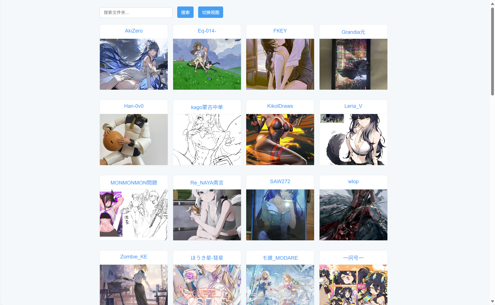

# bili-dynamics

用bilibili-api写的用于下载指定用户的图文动态

## 使用说明

在user_list.txt中添加需要的名称和uid，然后运行a_download_all.py，会爬取并下载图文动态。
可在已保存的图文动态之上追加新的图文动态。
a_re_download_all.py的作用是重试失败的下载。

## 更改
用gpt写了个web应用用来预览保存的图片

